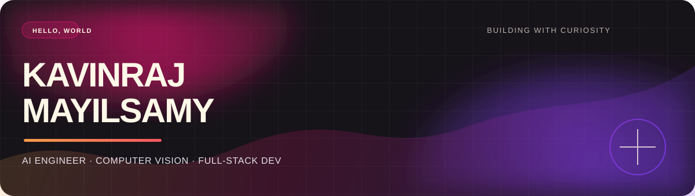

  

  
  
  
  

## About me

I’m **Kavinraj M**, a B.Tech Artificial Intelligence student at **SRMIST** and a computer-vision research intern. I turn ambitious AI ideas into clear, useful products—from explainable remote-sensing models to full-stack ML platforms.

> _Researcher by curiosity, engineer by accident._

  
  
  
  

## What I’m building

- **SegXAL-VLM** — an explainable active-learning framework for remote-sensing segmentation using CLIP, DINO, and text-guided attention.
- **Forecastly** — AI-assisted advertising forecasting that turns campaign data into revenue forecasts and budget recommendations.
- **BugTriage AI** — an AI workflow for classifying bug reports, detecting duplicates, and routing issues to the right team.

  
  

